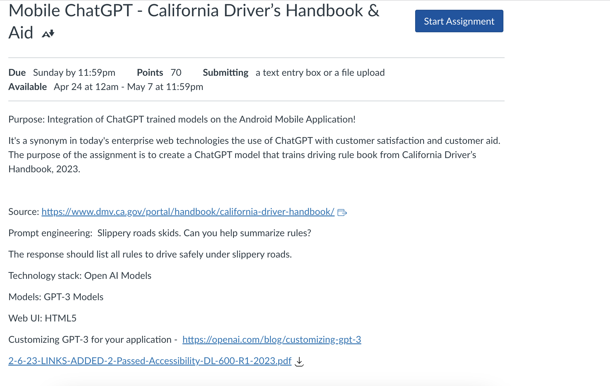
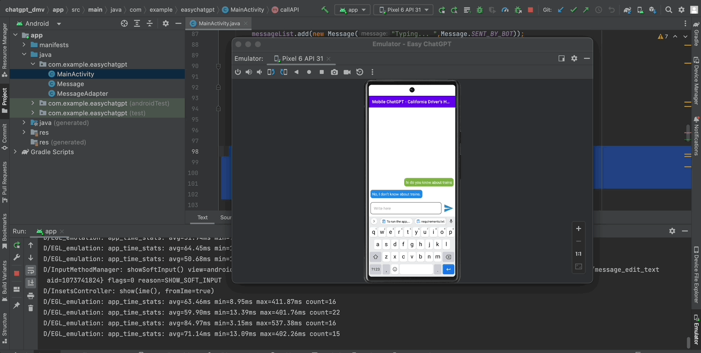
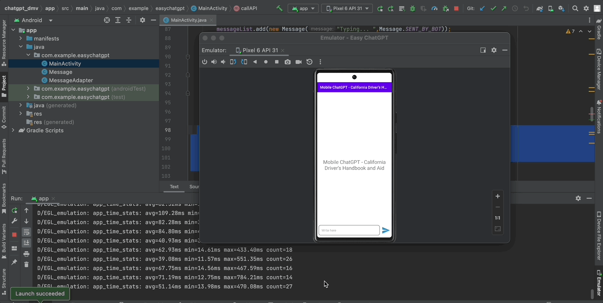

### CMPE277-Mobile ChatGPT - California Driver’s Handbook & Aid
### Course: Smartphone Application Development
### Student Name : Sirisha Polisetty

### Learning Objective:

Integration of ChatGPT trained models on the Android Mobile Application!



### Tools and Technologies used
Frontend: Andriod <br/>
Backend: Python Django framework<br/>
Other tools: Visual studio code<br/>
Third party technologies:Open AI API

### Djang Backend: 

To run the app, First need to install the required dependencies listed in the requirements.txt file.

```
pip install -r requirements.txt
````

 Next, Need to set the OPENAIAPI_KEY environment variable to your OpenAI API key. You can do this by running export OPENAIAPI_KEY=<your_api_key> in your terminal. Alternatively, you can set the variable in your OS environment variables.

### Then, Start the Django development server by running.

```
python manage.py runserver
```


### Android ChatGPT APP

To use this endpoint in your Android app, you need to make an API call to the URL provided by the Django app. You can use OkHttp to make the API call in your Android app. To ensure that the Django app allows requests from the Android emulator, you need to add the emulator's IP address to the ALLOWED_HOSTS setting in your Django app's settings.py file. You can find the emulator's IP address by running adb shell ifconfig in your terminal.

#### Android ChatGPT APP Prompt


#### Android ChatGPT APP Prompt for Skids


## References

https://platform.openai.com/playground

https://colab.research.google.com/drive/181BSOH6KF_1o2lFG8DQ6eJd2MZyiSBNt?usp=sharing#scrollTo=NalD3XkQWrJR


